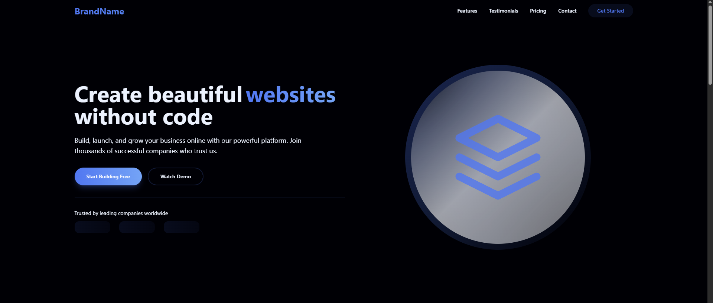
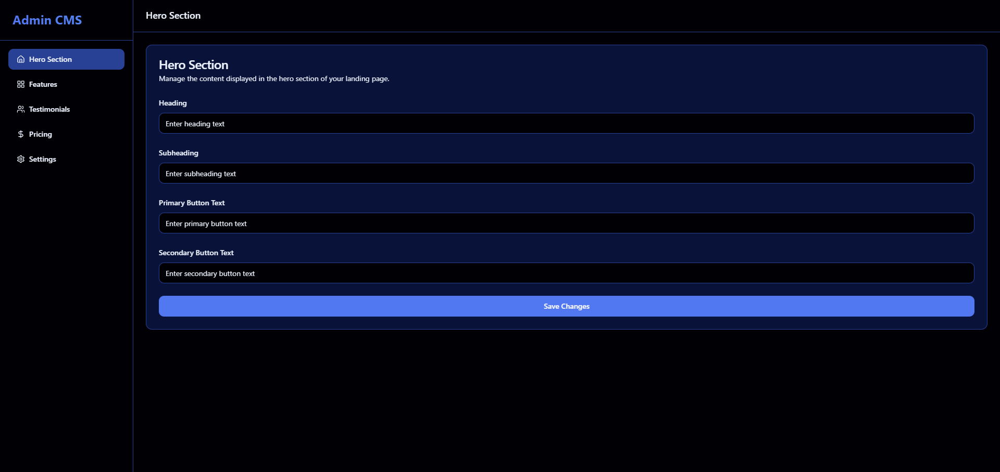
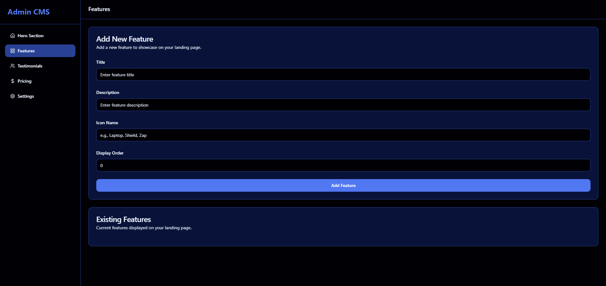
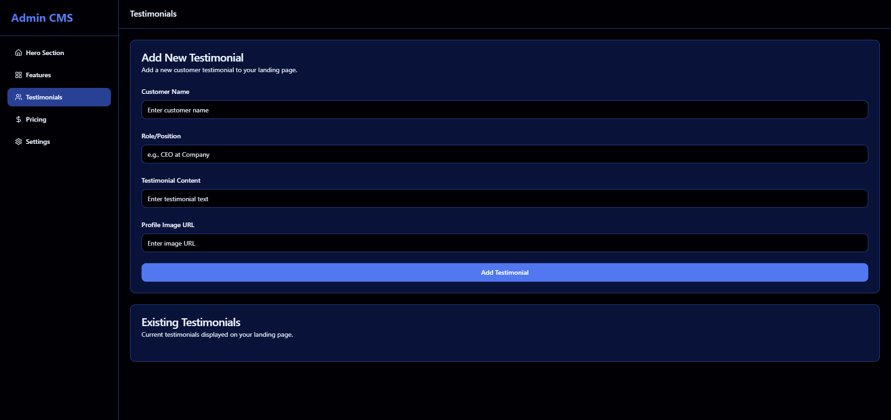
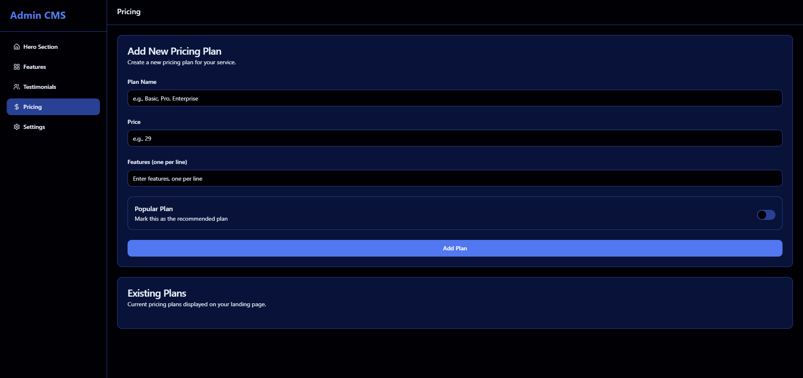
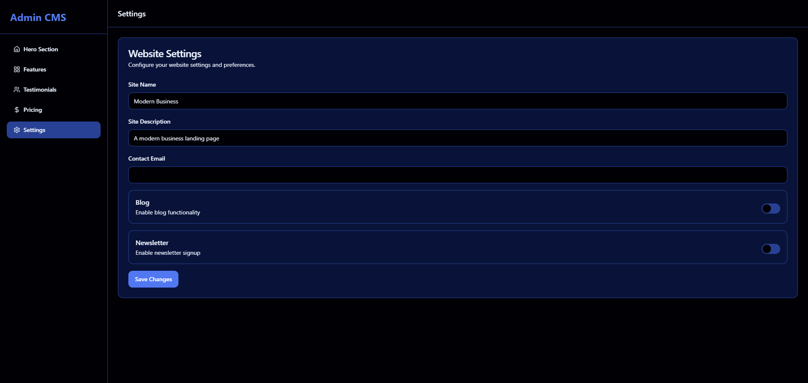

# MarketBoost - Modern React & TypeScript SaaS Landing Page Template with CMS Integration

A modern, conversion-optimized business landing page template with built-in CMS, perfect for agencies, startups, and businesses. Built with React, TypeScript, Tailwind CSS and Express.js.



## 🌟 Key Features

- Modern Dark Theme Design
- Fully Responsive Layout  
- Built-in CMS Dashboard
- Performance Optimized
- Live Demo Available
- PostgreSQL Database
- SEO Friendly
- Easy Customization
- API Documentation

## 🛠 Tech Stack

- React 18 with TypeScript
- Tailwind CSS
- Shadcn UI Components
- Express.js Backend
- PostgreSQL + Drizzle ORM
- Framer Motion Animations

## 📦 Quick Start

1. Clone repository
2. Install dependencies:
```bash
npm install
```

3. Set environment variables:
```env
DATABASE_URL=your_postgresql_database_url
```

4. Initialize database:
```bash
npm run db:push
```

5. Start development server:
```bash
npm run dev
```

The app will run on http://localhost:5000

## 🎨 Customization

### Theme
Edit `theme.json` to customize:
- Color scheme
- Typography
- Dark/light mode
- Border radius

### Content
Access CMS dashboard at `/admin` to manage:
- Hero section
- Features
- Testimonials  
- Pricing plans

### CMS Screenshots
The following screenshots demonstrate the CMS interface:











## 📚 API Documentation

### Hero Section
- `GET /api/cms/hero` - Retrieve active hero section content
  - Response: `{ id, heading, subheading, primaryButtonText, secondaryButtonText, isActive, updatedAt }`
- `POST /api/cms/hero` - Create or update hero section content
  - Body: `{ heading, subheading, primaryButtonText, secondaryButtonText, isActive }`
  - Response: Created hero content object

### Features  
- `GET /api/cms/features` - Retrieve all features
  - Response: Array of feature objects `[{ id, title, description, icon, order }]`
- `POST /api/cms/features` - Create a new feature
  - Body: `{ title, description, icon, order }`
  - Response: Created feature object

### Testimonials
- `GET /api/cms/testimonials` - Retrieve all testimonials
  - Response: Array of testimonial objects `[{ id, name, role, content, image }]`
- `POST /api/cms/testimonials` - Create a new testimonial
  - Body: `{ name, role, content, image }`
  - Response: Created testimonial object

### Pricing
- `GET /api/cms/pricing` - Retrieve all pricing plans
  - Response: Array of pricing plan objects `[{ id, name, price, features, isPopular }]`
- `POST /api/cms/pricing` - Create a new pricing plan
  - Body: `{ name, price, features, isPopular }`
  - Response: Created pricing plan object

### Contact Form
- `POST /api/contact` - Submit contact form
  - Body: `{ name, email, message }`
  - Response: Created contact object

## 🌐 Browser Compatibility

MarketBoost is fully tested and compatible with:
- Google Chrome (latest)
- Mozilla Firefox (latest)
- Safari (latest)
- Microsoft Edge (latest)

## 🔧 Troubleshooting

### Common Issues

#### Database Connection Issues
- Ensure your PostgreSQL server is running
- Verify DATABASE_URL is correctly set in your environment variables
- Check network connectivity if using a remote database

#### Build Errors
- Run `npm install` to ensure all dependencies are installed
- Clear node_modules and package-lock.json and reinstall if needed
- Ensure you're using Node.js version 16 or higher

#### CMS Dashboard Access Issues
- Contact your administrator for login credentials
- Ensure server is running with proper permissions

## 🔄 Performance Optimization

- All images are optimized and served in WebP format
- CSS and JavaScript are minified in production builds
- Lazy loading implemented for images and heavy components
- PageSpeed score of 90+ on both mobile and desktop

## 📱 Mobile Responsiveness

The template is fully responsive with specific optimizations for:
- Mobile phones (320px+)
- Tablets (768px+)
- Desktops (1024px+)
- Large screens (1440px+)

## 🔗 Resources

- [Live Demo](https://marketboost-demo.vercel.app/)
- [Documentation](https://marketboost-demo.vercel.app/docs)
- [Support](https://saweria.co/ridwangatro21)

## 📄 License

[MIT License](LICENSE)